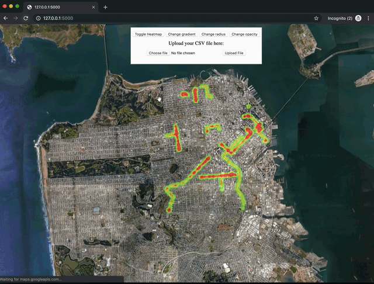

# Telematics HeatMap (Still under development)
This project is a visualization library for telematics data. The project aims to make it easier to get render data visualizations from CSV files. To use this application upload a CSV containing the fields `lat` and `lon` (case insenstive) and the application will render a heat map visualization of the data points. 

## Input Rules
* Any CSV file is accepted.
* CSV files should contain columns with at-most 2 columns that contain the following substrings `lat` and `lon`. Example column names that will be accepted as valid input are `Lat`, `Lon`, `lat`, `lon`, `Latitude`, `Longitude`, `MyLatitudes`, etc. 
* CSV files can contain other data columns. This app will only scrap the 2 `lat` and `lon` sub-stringed columns it expects.
* The ordering and relative positions of the `lat` and `lon` sub-stringed columns does not matter. 

## Additional Functionalities
This app also comes with the following functionality:
* Toggling heatmap on and off.
* Changing gradient of heatmap visualization.
* Changing radius of heatmap visualization.
* Changing opacity of heatmap visualization.

# Preview of Running Application



# Getting Started

To use Google Maps in the front-end web appliacation, a Google Maps Javascript API key is required. The instructions of obtaining the API key are documented [here] (https://developers.google.com/maps/documentation/javascript/get-api-key).

* Also, ensure that you are running in a Python 3 environment.

# Running the Application Locally
1. Setup virtual environment
```
python3 -m venv env
source ./env/bin/activate
python -m pip install package
```

2. Setup the `MAPS_API_KEY` environment variable in your virtual environment :
`export MAPS_API_KEY=<MAPS_API_KEY_FROM_GOOGLE>`

3. Install dependencies required by application :
`pip install --no-cache-dir -r requirements.txt`

4. Run the application locally:
`python main.py`

5. Access the front-end web application: 
In your web browser, navigate to the address `http://127.0.0.1:5000/` and upload a CSV file with your telematics data. 

# Running the Application in Docker

1. To build application, run: 

`docker build -t heatmapimage .`

2. To run application, run: 

`docker run -d --name heatmaps -e MAPS_API_KEY=<MAPS_API_KEY_FROM_GOOGLE> -p 1337:80 heatmapimage`

You should be able to check access the web front end of the application on http://localhost:1337/ . Submit a CSV file with your telematics data and click upload to visualize your data.

